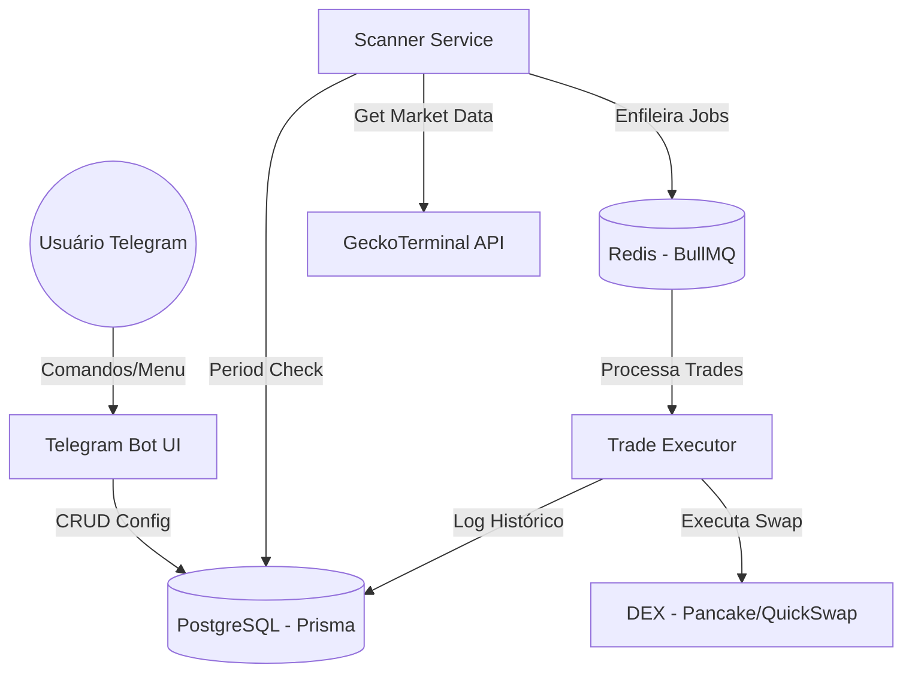
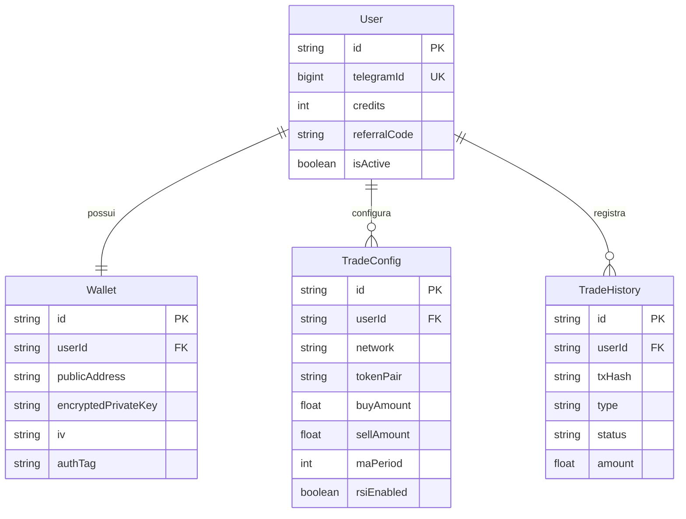

# 🏗️ ARCHITECTURE: Blockchain Trader Skeleton

Documentação técnica profunda sobre a estrutura, fluxos de dados e segurança do 'Blockchain Trader'.

## 📱 Visão Geral da Arquitetura (C4 Model - Level 1)

---

## 🗄️ Modelo de Dados (ERD)

---

## 🛡️ Protocolo de Segurança: Carteiras Criptografadas

O sistema armazena chaves privadas utilizando **AES-256-GCM**, garantindo que as chaves nunca fiquem em texto claro no banco de dados.

### Fluxo de Criptografia:
1.  **Entrada**: Usuário fornece a Private Key via bot (opcional - geração interna recomendada).
2.  **Processo**: 
    - Geração de um IV (Initialization Vector) único.
    - Criptografia com `ENCRYPTION_KEY` (armazenada em `.env` na VPS).
    - Obtenção do AuthTag (GCM).
3.  **Armazenamento**: `encryptedPrivateKey`, `iv` e `authTag` são salvos no banco.

---

## 🔄 Ciclo de Decisão de Trade (Scanner/Strategy)

A cada minuto, o `Scanner` executa o seguinte algoritmo por configuração:

1.  **Check de Operação**: `isOperating == true`.
2.  **Check de Janela**: O minuto atual está dentro de [windowMin, windowMax]?
3.  **Análise de Sinal**:
    - Obtém velas de 15m e 4h via GeckoTerminal.
    - Calcula MA21 para ambas e RSI14 se ativo.
    - **BUY**: Preço cruza ABAIXO da MA(15m) e MA(4h) indica tendência de alta.
    - **SELL**: Preço cruza ACIMA da MA(15m) (Realização de lucro).
4.  **Execução**: Adiciona Job ao Redis para processamento pelo `TradeExecutor`.
