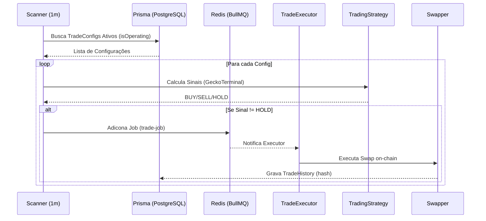

# 🗺️ SYSTEM ATLAS: Blockchain Trader Inventory

Este documento é a 'Fonte da Verdade' (Source of Truth) para todos os ativos, fluxos e tabelas do sistema 'Blockchain Trader'.

### 1. Dualidade de Serviços de Sinais (Resolvido no Atlas)
*   **Status**: ✅ Documentado
*   **Descoberta**: Existem dois arquivos: `src/services/indicator.js` (usado pelo `scheduler.js`) e `src/services/tradingStrategy.js` (usado pelo `tradeExecutor.js`).
*   **Ação**: A arquitetura agora distingue o `Indicator` como motor do Scheduler Global e o `Strategy` como motor da fila de trades individuais.

## 📦 Inventário de Serviços (Services)

| Nome | Arquivo | Responsabilidade | Status |
| :--- | :--- | :--- | :--- |
| **Trading Strategy** | `tradingStrategy.js` | Cálculo de sinais multi-tenant (MA21, RSI) para o **Trade Executor**. | ✅ Robusto |
| **Indicator Service**| `indicator.js` | Serviço de indicadores (MA, RSI) para o **Scheduler** (Legado/Global). | ⚠️ Redundante |
| **Swapper** | `swapper.js` | Execução on-chain de swaps (Buy/Sell), roteamento multi-hop e anti-sanduíche. | ✅ Produção |
| **Blockchain** | `blockchain.js` | Gestão de Providers (BSC/Polygon), Fallback de RPC e Wallets. | ⚠️ RPC Variável |
| **Scheduler** | `scheduler.js` | Gestão de janelas de execução (Cron/Interval) para trades. | ✅ Funcional |
| **Scanner** | `scanner.js` (Worker) | Verificação periódica de condições de trade para todos os usuários. | ✅ 1m Interval |
| **Executor** | `tradeExecutor.js` | Processamento assíncrono de jobs de trade via BullMQ. | ✅ Redis-backed |
| **Bot UI** | `src/bot/index.js` | Interface de administração via Telegram (Telegraf.js). | ✅ Ativo |
| **Billing** | `billingService.js` | Controle de créditos e assinaturas de usuários. | ✅ Implementado |

---

## 🗄️ Mapa de Dados (Database Schema)

| Tabela | Campos Chave | Relação | Descrição |
| :--- | :--- | :--- | :--- |
| **User** | `telegramId`, `id` | 1:1 Wallet, 1:N TradeConfig | Registro principal de usuários. |
| **Wallet** | `publicAddress`, `userId` | 1:1 User | Armazenamento de carteiras criptografadas (AES-GCM). |
| **TradeConfig** | `userId`, `network`, `pool` | N:1 User | Configurações de trading (BCOIN, SEN, RSI). |
| **TradeHistory** | `userId`, `txHash` | N:1 User | Log permanente de transações on-chain. |

---

## 🔗 APIs Externas e Dependências

| Serviço | Uso | Endpoint Principal |
| :--- | :--- | :--- |
| **GeckoTerminal** | Dados de Mercado | `api.geckoterminal.com/api/v2` |
| **PancakeSwap** | Swap (BSC) | Router `0x10ed43c718714eb63d5aa57b78b54704e256024e` |
| **QuickSwap** | Swap (Polygon) | Router `0xa5e0829caced8ffdd4de3c43696c57f7d7a678ff` |

---

## 🔄 Fluxo de Trabalho: Ciclo de Autotrade

---

## ⚠️ Checklist de Pendências (Inventory-based)
- [ ] Documentar como cadastrar tokens customizados via Bot.
- [ ] Explicar o sistema de Referral (Referral System) implementado no schema mas não ativado totalmente.
- [ ] Detalhar o fluxo de pagamento recorrente via Stripe.
