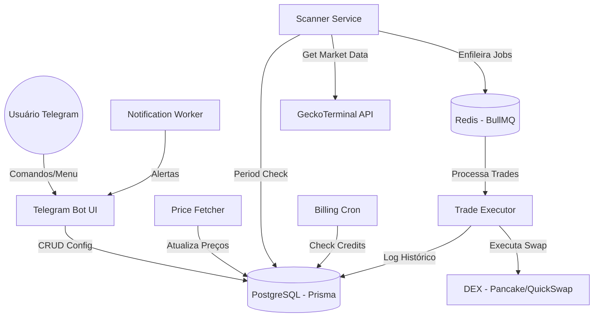
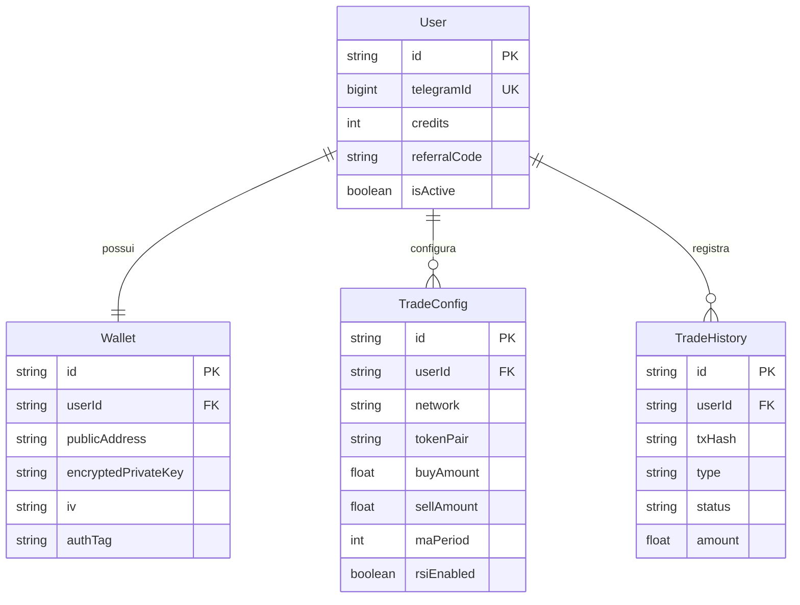
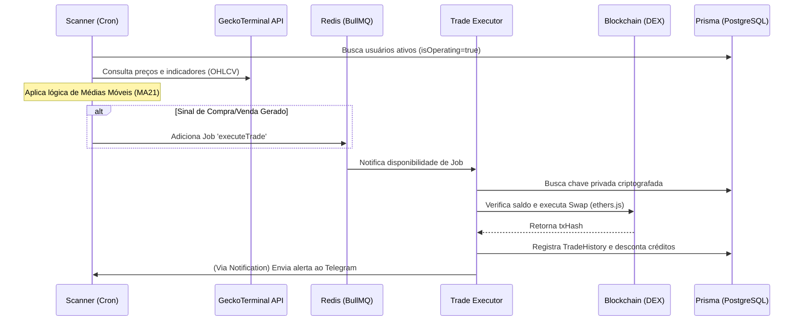

# 🏗️ ARCHITECTURE: Blockchain Trader Skeleton

Documentação técnica profunda sobre a estrutura, fluxos de dados e segurança do 'Blockchain Trader'.

## 📱 Visão Geral da Arquitetura (C4 Model - Level 1)

---

## 📂 Estrutura de Arquivos (Project Map)

O projeto segue um padrão de organização modular para garantir escalabilidade:

- **`/src`**: Código fonte principal.
    - `api/`: Controladores e rotas (se houver).
    - `bot/`: Lógica do Telegram UI e menus.
    - `worker/`: Processos em background (Scanner, Executor, Billing, etc).
    - `config/`: Configurações de Banco (Prisma) e Redis.
    - `services/`: Lógica de negócio e integrações blockchain.
    - `utils/`: Loggers e helpers de criptografia.
- **`/prisma`**: Definições de schema e migrações.
- **`/legacy`**: Arquivamento de scripts de teste e arquivos órfãos (Fase 1 Discovery).
- **`/logs`**: Logs operacionais (`combined.log`, `error.log`).
- **`/docker`**: Arquivos de configuração de infraestrutura.
- **`index.js`**: Orquestrador de inicialização de todos os serviços.

---

## 🗄️ Modelo de Dados (ERD)

---

## 🛡️ Protocolo de Segurança: Carteiras Criptografadas

O sistema armazena chaves privadas utilizando **AES-256-GCM**, garantindo que as chaves nunca fiquem em texto claro no banco de dados.

### Fluxo de Criptografia:
1.  **Entrada**: Usuário fornece a Private Key via bot (opcional - geração interna recomendada).
2.  **Processo**: 
    - Geração de um IV (Initialization Vector) único.
    - Criptografia com `ENCRYPTION_KEY` (armazenada em `.env` na VPS).
    - Obtenção do AuthTag (GCM).
3.  **Armazenamento**: `encryptedPrivateKey`, `iv` e `authTag` são salvos no banco.

---

## 🔄 Ciclo de Decisão de Trade (Scanner/Strategy)

O sistema opera em um ciclo contínuo de "Scan -> Queue -> Execute". Abaixo o detalhamento do fluxo:

### Detalhamento das Etapas:

1.  **Check de Operação**: O `Scanner` verifica se o usuário tem saldo de créditos positivo e se o bot está ligado.
2.  **Check de Janela**: Validação se o minuto atual está em uma das janelas configuradas (ex: 15-29m).
3.  **Análise de Sinal**:
    - Obtém velas de 15m e 4h via GeckoTerminal.
    - Calcula MA21 e outros indicadores (RSI opcional).
    - **BUY**: Preço cruza ABAIXO da MA(15m) e MA(4h) indica tendência de alta.
    - **SELL**: Preço cruza ACIMA da MA(15m).
4.  **Execução**: O `TradeExecutor` gerencia a assinatura da transação e o envio para a rede (BSC/Polygon).
