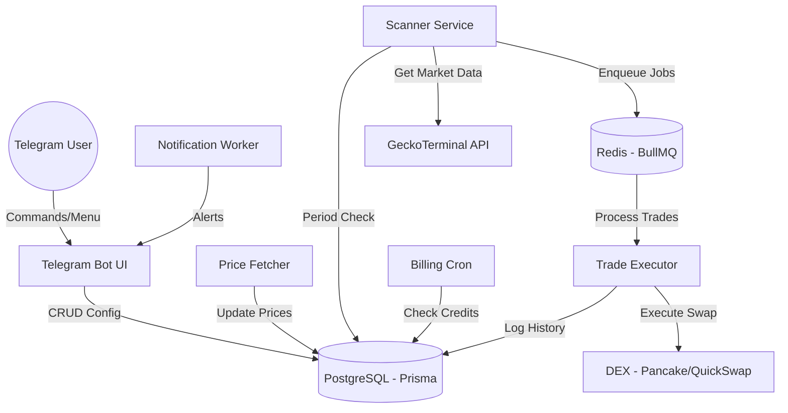
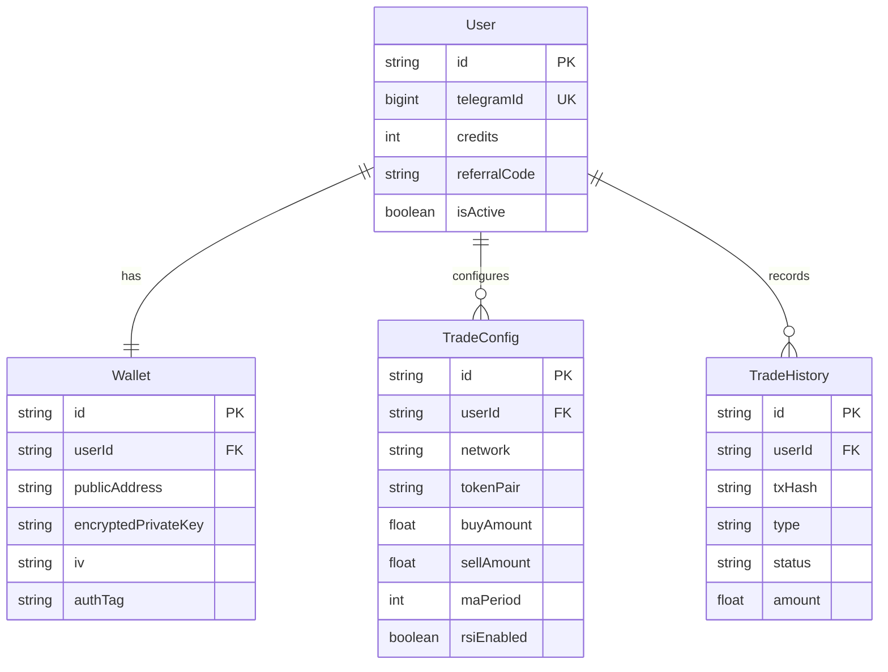
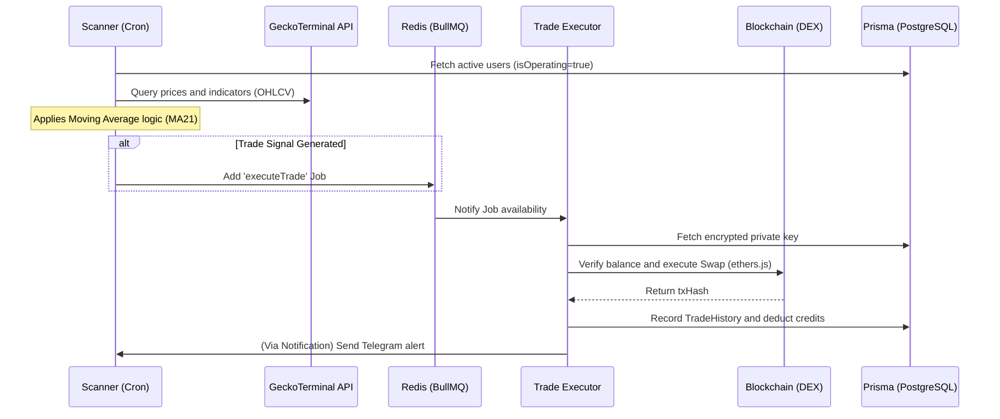

# 🏗️ ARCHITECTURE: Blockchain Trader Skeleton

Technical documentation on the structure, data flows, and security of 'Blockchain Trader'.

## 📱 Architecture Overview (C4 Model - Level 1)

---

## 📂 File Structure (Project Map)

The project follows a modular organization pattern to ensure scalability and clarity for the Open Source community:

- **`/src`**: Main source code (Business Logic).
    - `bot/`: Telegram Interface (Menus, Telegraf).
    - `worker/`: Background Workers (Scanner, Executor, Billing).
    - `services/`: Blockchain Services, Swapper, and Pricing.
    - `config/`: Configuration Singleton (Prisma, Redis, Env).
- **`/test`**: Test suite (Database, RPC, Balances, Trade Logic).
- **`/scripts`**: Utility, deployment, and assisted audit scripts.
- **`/docs`**: Detailed technical documentation and manuals.
- **`/tools`**: On-chain analysis tools and pool debugging.
- **`/prisma`**: Database schema and migrations.
- **`index.js`**: Entry point (System Bootloader).
- **`docker-compose.yml`**: Infrastructure orchestrator (Postgres/Redis/Bot).

---

## 🗄️ Data Model (ERD)

---

## 🛡️ Security Protocol: Encrypted Wallets

The system stores private keys using **AES-256-GCM**, ensuring that keys are never stored in plain text in the database.

### Encryption Flow:
1.  **Input**: User provides the Private Key via bot (optional - internal generation recommended).
2.  **Process**: 
    - Generation of a unique IV (Initialization Vector).
    - Encryption with `ENCRYPTION_KEY` (stored in `.env` on the VPS).
    - Obtaining the AuthTag (GCM).
3.  **Storage**: `encryptedPrivateKey`, `iv`, and `authTag` are saved in the database.

---

## 🔄 Trade Decision Cycle (Scanner/Strategy)

The system operates in a continuous "Scan -> Queue -> Execute" cycle. Below is the flow detail:

### Step Detail:

1.  **Operation Check**: The `Scanner` checks if the user has a positive credit balance and if the bot is turned on.
2.  **Window Check**: Validation of whether the current minute is within one of the configured windows (e.g., 15-29m).
3.  **Signal Analysis**:
    - Gets 15m and 4h candles via GeckoTerminal.
    - Calculates MA21 and other indicators (RSI optional).
    - **BUY**: Price crosses BELOW MA(15m) and MA(4h) indicates uptrend.
    - **SELL**: Price crosses ABOVE MA(15m).
4.  **Execution**: The `TradeExecutor` manages transaction signing and submission to the network (BSC/Polygon).
5.  **Operational Audit**: The script `src/scripts/audit_fix.js` allows for manual integrity verification of all components (RPC, DB, Redis, Wallet).

---

## 🛠️ Maintenance and Aegis (OpenClaw) Deactivation

Originally, the system used an AI module called **Aegis (OpenClaw)** for automatic error detection and correction. After production auditing, this module was **DEACTIVATED** for the following reasons:
-   **API Instability**: Recurring failures in the AI token limit (Google Gemini).
-   **Notification Loops**: The system entered recursion when trying to report network errors through the same unstable network.
-   **Operational Security**: Remote auto-maintenance was replaced by an **Assisted Audit** model, where the administrator uses diagnostic tools to validate the system before manual interventions.

Currently, Aegis remains in the repository only as historical reference, not interfering with the main execution cycle.
