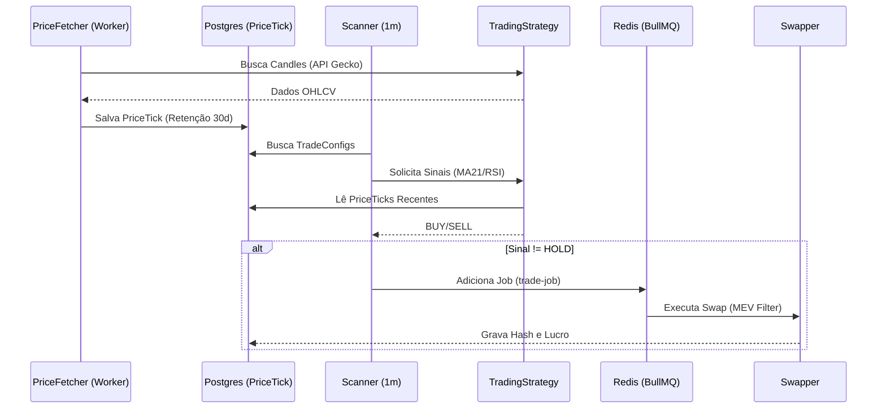

# 🗺️ SYSTEM ATLAS: Blockchain Trader Inventory

Este documento é a 'Fonte da Verdade' (Source of Truth) para todos os ativos, fluxos e tabelas do sistema 'Blockchain Trader'.

### 🟢 Status do Ambiente (Produção VPS)
*   **Hospedagem**: VPS Locaweb (Ubuntu 20.04)
*   **Orquestração**: Docker Compose (Containers: `trader-engine`, `trader-db`, `trader-redis`)
*   **Banco de Dados**: PostgreSQL 15 (Porta interna 5432, mapeada 5433)
*   **Cache/Queue**: Redis 7 (Porta interna 6379, mapeada 6380)

### 1. Evolução do Motor de Sinais
*   **Status**: ✅ Ativo (Interno)
*   **Mudança Estratégica**: O sistema não depende mais da API GeckoTerminal em tempo real para cada cálculo de sinal. 
*   **Nova Arquitetura**: 
    1.  `PriceFetcher` (Worker) coleta candles e salva na tabela `PriceTick`.
    2.  `TradingStrategy` consome dados diretamente do SQL, reduzindo custos de API e latência.
    3.  Retenção configurada para **30 dias** no banco de dados.

## 📦 Inventário de Serviços (Services)

| Nome | Arquivo | Responsabilidade | Status |
| :--- | :--- | :--- | :--- |
| **Price Fetcher** | `priceFetcher.js` | Coleta de dados de mercado e população do `PriceTick` (SQL). | ✅ Ativo |
| **Trading Strategy**| `tradingStrategy.js` | Cálculo de sinais (MA21, RSI) consumindo o Banco de Dados Interno. | ✅ Produção |
| **Swapper** | `swapper.js` | Execução on-chain, roteamento e **Proteção MEV** configurável. | ✅ Ativo |
| **Blockchain** | `blockchain.js` | Gestão de Providers e Fallback de RPC. | ✅ RPC Estável |
| **Indicator Service**| `indicator.js` | **REMOVIDO**: Redundante. Lógica unificada no `TradingStrategy`. | 🗑️ Deletado |

---

## 🗄️ Mapa de Dados (Database Schema)

| Tabela | Campos Chave | Descrição |
| :--- | :--- | :--- |
| **User** | `telegramId`, `id` | Registro principal de usuários e status de admin. |
| **TradeConfig** | `antiSandwichEnabled` | Configurações de trade + Flag de Proteção MEV. |
| **PriceTick** | `pairAddress`, `price` | Dados históricos de preço (Candles) para indicadores. |
| **TradeHistory** | `txHash`, `status` | Log permanente de transações e ganhos. |

---

## 🔄 Fluxo de Trabalho: Ciclo Antifrágil

---

## ⚠️ Checklist de Pendências (Fase Atual: 1/100)
- [x] Sincronização Local -> VPS (Docker).
- [x] Correção de credenciais e Bot Token.
- [ ] Ativar sistema de Billing (Créditos) para usuários.
- [ ] Ativar sistema de Referral (Referal Code).
